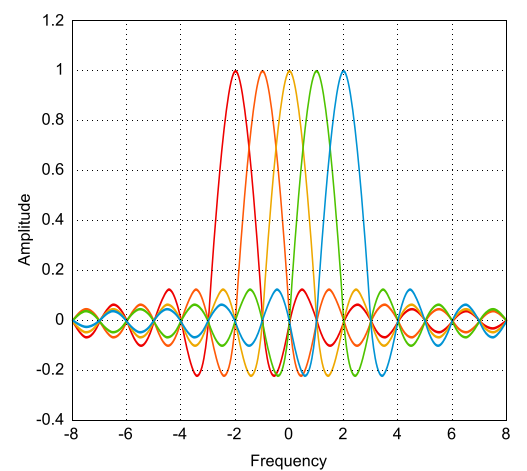

# Proyecto Final - Comunicaciones Digitales

## OFDM: "Orthogonal Frequency Division Multiplexing"

  

## Descripción

Proyecto de investigación y simulación de la modulación OFDM, para su posterior implementación en SDR (Software Defined Radio).

La modulación OFDM es una técnica de transmisión que divide un canal de comunicación en múltiples subportadoras ortogonales, permitiendo una transmisión eficiente y robusta frente a interferencias y desvanecimientos.

## Integrantes

- SAILLEN, Simón. ([@simi-sai](https://www.github.com/simi-sai))
- VENECIA, Milagros Ailín. ([@MVene](https://www.github.com/MVene))
